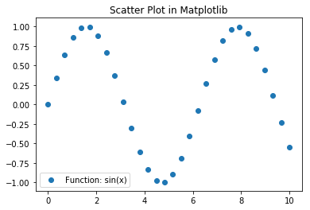
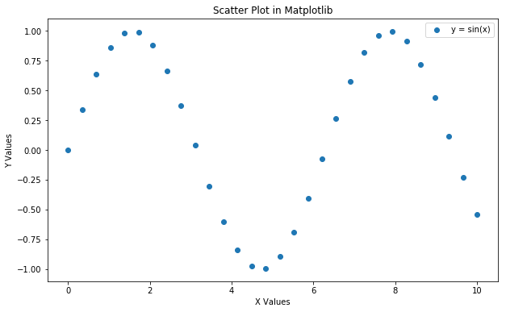
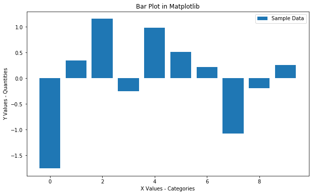
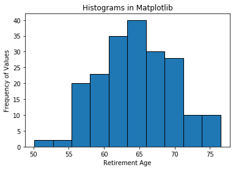
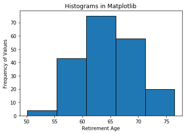

# Data Visualization

## Introduction

This lesson introduces data visualization using Python and the popular Matplotlib plotting library. We shall look into the elements of standard Matplotlib plots and how to use them for creating and customizing visualizations. 

## Objectives
You will be able to:
* Understand the Matplotlib plot structure for drawing basic plots.
* Visualize data using scatterplots, barplots and histograms

## Matplotlib Plotting Library

The Matplotlib plotting library provides a range of built in functions to start visualizing data with minimum effort. 

Let's first import matplotlib's `pyplot` module (a module is a unit of prewritten code that we can use in our projects) into our working environment along with `numpy` (one of the most popular libraries in Python for scientific computing) to create our sample data. We shall import the `pyplot` module from `matplotlib` as it provides simple and agile creation of desired plots. 

Following import statement must be provided before using `matplotlib.pyplot`.

```python
import matplotlib.pyplot as plt

```

In jupyter notebooks, you can use `%matplotlib` magic with `inline` to show plots inside the notebook or `qt` for external/interactive plots. `inline` is recommended for most requirements (external plots are suitable for interactive visualizations).  


```python
# Import matplotlib
import matplotlib.pyplot as plt

# Set plot space as inline for inline plots and qt for external plots
%matplotlib inline
```

## Scatter plot

A scatter plot is a two-dimensional data visualization that uses dots to represent the values obtained for two different variables - one plotted along the x-axis and the other plotted along the y-axis. 

Scatter plots are used when you want to show the relationship between two variables. Scatter plots are sometimes called correlation plots because they show how two variables are correlated. 


Let's use python's `numpy` library to create sample data. Numpy is a specialized package for scientific computing. It is primarily used for performing numerical operations. Don't worry about all of the details surround numpy right now, it will be introduced formally later. For now, we shall use [numpy's `linspace()` function](https://docs.scipy.org/doc/numpy-1.14.5/reference/generated/numpy.linspace.html) to quickly generate some dummy data for visualizations. The industry standard is to alias numpy as np.


```python
# Import numpy to generate some dummy data
import numpy as np

# Generate an array x of 30 equally spaced data points on a line space of 0 - 10.
x = np.linspace(0, 10, 30)
# Calcuate sin(x) and save in a new array y
y = np.sin(x)
```

Now that we have our data ready, We shall create a scatter plot using `plt.scatter()` function which can take in two vectors and shows their relationship. We can optionally pass in extra parameters like `label` to provide information to the plot, `plt.title()` for defining a title and `plt.legend()` to add this context information to the plot. Finally we shall use `plt.show()` functions to output the plot.


```python
# Pass in x and y values with a label 
plt.scatter(x, y, label = "Function: sin(x)" )
plt.title('Scatter Plot in Matplotlib')
plt.legend()
plt.show()
```





So above shows the harmonic relationship between variables i.e. the sine wave. We can customize the plot further to make it easier to read as below:

Let's provide labels for both axes in the above chart by using `plt.xlabel` and `plt.ylabel`. We can also change the size of the plot with `plt.figure(figsize=(a,b))`, where a and b are inches for width and height of the plot. Let's see this in action below:


```python
# Set the figure size in inches
plt.figure(figsize=(10,6))

plt.scatter(x, y, label = "y = sin(x)" )

# Set x and y axes labels
plt.xlabel('X values')
plt.ylabel('Y values')

plt.title('Scatter Plot in Matplotlib')
plt.legend()
plt.show()
```





Remember, labeling and other customizations that you see here are applicable to almost all kinds of plots in matplotlib as we shall see ahead. 

### Bar Graph or Column Graph.

Bar charts are one of the most common plot types for showing comparisons between data elements. A bar chart or column graph allows comparisons across categories by presenting categorical data as rectangular bars with heights or lengths proportional to the values that they represent. One axis of the chart shows the specific categories being compared and the other axis represents a discrete value scale. The bars can be plotted vertically or horizontally.


Matplotlib comes packaged with a number of handy plotting functions. Matplotlib's `.bar()` and `.barh()` methods can be used to draw constant width vertical and constant height horizontal bar graphs for a simple sequence of x, y values. Let's plot a simple vertical bar graph with `.bar()` function. In the above example, we had the same number of values in both x and y. Let's generate some more data in numpy for plotting first. To do this, some functions from the ```np.random``` library will be used. This is a specialized library for generating random numbers. Don't worry if the code seems unfamiliar now, the details of using numpy for generating random numbers will be covered in detail later.


```python
# Set seed for reproducability
np.random.seed(100)

# Generate variable x as 10 categories using numpy's arange function for x-axis
x = np.arange(10)

# For y-axis, generate 10 random quantities from the “standard normal” distribution (zero mean) 
# using numpy's random.randn() function
y = np.random.randn(10)
```

Now let's plot a bar graph based on above data.


```python
plt.figure(figsize=(10,6))

# Use bar() function to create a plot using above values on both x and y co-ordinates. Add a label.
plt.bar(x, y, label='Sample Data')

plt.xlabel('X values - categories')
plt.ylabel('Y values - quantities')

plt.title('Bar Plot in Matplotlib')
plt.legend()

# Output the final plot
plt.show()
```





With such a bar graph, we can easily inspect the quantities in each category (0-10) and make informed decisions about data distribution in these categories. 

##  Histograms 

A histogram is a plot that lets you discover the underlying frequency distribution of a set of continuous data. This allows the inspection of the data for its underlying distribution (e.g., normal distribution), outliers, skewness, etc. An example of a histogram, and the raw data it was constructed from, is shown below:


Basically, histograms are used to represent data given in form of some groups. X-axis is about bin ranges where Y-axis talks about frequency. So, if you want to represent age wise population in form of graph then histogram suits well as it tells you how many exists in certain group range or bin, if you talk in context of histograms.

Bars Charts are distinguished from Histograms, as they do not display continuous developments over an interval. Bar Chart's discrete data is categorical data and therefore answers the question of "how many?" in each category.

<br>

<br>

In matplotlib, we can use `plt.hist()` function to draw a histogram while passing in values from the required data variable. First, we shall use the `np.random.randn()` function again to generate 200 numbers with a 0 mean normal distribution.


```python
# Set seed for reproducability
np.random.seed(100)

# Generate 200 values from 0 mean normal distribution
x = np.random.randn(200)

#Plot the histogram with hist() function
plt.hist(x, bins = 10)

plt.xlabel('Normal random distribution')
plt.ylabel('Frequency of Values')
plt.title('Histograms in matplotlib')
plt.show()
```





Y-axis tells about the frequency a certain number appears in data set. Since this data was normally distributed, the probability of appearing increases as we move towards the 0 mean, so the tallest bar appears to be around 0. 

### The `bins` argument
we can optionally pass the `bins` argument to describe the width the slot or range, in our case it is 10 that is, whatever values will be generated,  will be divided by bin value and get plotted. Let's say we change it to 5 below.


```python
plt.hist(x, bins = 5)
plt.xlabel('Normal Distribution')
plt.ylabel('Frequency of values')
plt.title('Histograms in matplotlib')
plt.show()
```





The granularity of bins can be changed according to the analytical needs and amount of underlying data. So if we generate a lot of numbers, and use lots of bins, it starts to look like a more "bell-shaped" normal distribution, as shown below:


```python
# Set seed for reproducability
np.random.seed(100)

# Generate 10000 values from 0 mean normal distribution
x = np.random.randn(10000)

#Plot the distogram with hist() function
plt.hist(x, bins = 50)

plt.xlabel('Normal random distribution')
plt.ylabel('Frequency of Values')
plt.title('Histograms in matplotlib')
plt.show()
```


Looks more like the usual "bell curve". Try increasing the number of values and bins further, and inspect the effect of output shape. 

## Summary

In this lesson, we learned how to use matplotlib's basic plotting techniques to visually describe our data. We also identified use cases for each of these techniques and learned how to customize and add basic details to a plot. 
